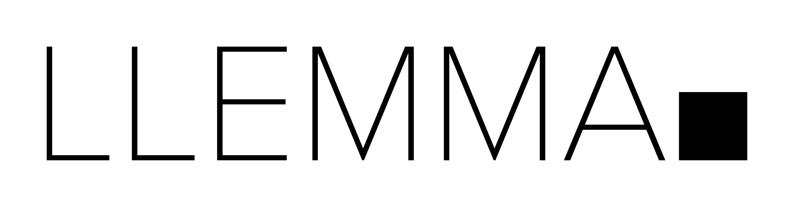

# `Llemma`: an open language model for mathematics


  
[ArXiv](http://arxiv.org/abs/2310.10631) | [Models](https://huggingface.co/EleutherAI/llemma_34b) | [Data](https://huggingface.co/datasets/EleutherAI/proof-pile-2) | [Code](https://github.com/EleutherAI/math-lm) | [Blog](https://blog.eleuther.ai/llemma/) | [Sample Explorer](https://llemma-demo.github.io/)

Repository for [Llemma: an open language model for mathematics [Azerbayev et al 2023]](https://arxiv.org/abs/2310.10631).

This repository hosts data and training code related to the following artifacts:

| Name | HF Hub Link |
| ---------- | ------------------ | 
| **Llemma 7b** |[`EleutherAI/llemma_7b`](https://huggingface.co/EleutherAI/llemma_7b)  | 
| **Llemma 34b** |[`EleutherAI/llemma_34b`](https://huggingface.co/EleutherAI/llemma_34b)  | 
| **Proof-Pile-2** |[`EleutherAI/ProofPile2`](https://huggingface.co/EleutherAI/proofpile2)  | 
| &nbsp;&nbsp;**AlgebraicStack** |[`EleutherAI/AlgebraicStack`](https://huggingface.co/EleutherAI/AlgebraicStack)  | 

This repository also contains submodules related to the overlap, fine-tuning, and theorem proving experiments described in the paper.
Additional evaluation code is in a [fork of the Eleuther LM Evaluation Harness](https://github.com/wellecks/lm-evaluation-harness).

## Directories 
This repository contains the following directories
- `proof_pile_2`: scripts for downloading and preprocessing data.
- `gpt-neox`: git submodule containing a modified branch of `EleutherAI/gpt-neox`
- `lm-evaluation-harness`: code for all evaluations, except formal2formal theorem proving.
- `llemma_formal2formal`: git submodule containing scripts for the formal2formal experiments
- `overlap`: git submodule containing the overlap and memorization analysis 
- `finetunes`: git submodule containing scripts for the fine-tuning experiments

Because this project contains submodules, you should clone this project with the `--recurse-submodules` flag or, alternatively, run `git submodule update --init --recursive` from within the project directory after cloning the project. After running `git pull`, you should also run `git submodule update`.

## Citation
Please cite the following:
```
@article{azerbayev2023llemma,
  title={Llemma: An Open Language Model For Mathematics}, 
  author={Azerbayev, Zhangir and Schoelkopf, Hailey and Paster, Keiran and Dos Santos, Marco and McAleer, Stephen and Jiang, Albert Q. and Deng, Jia and Biderman, Stella and Welleck, Sean},
  journal={arXiv preprint arXiv:2310.06786},
  year={2023}
}
```

You may also be interested in citing our training data, which is a mix of novel data and data from the following sources:
```
@article{paster2023openwebmath,
  title={OpenWebMath: An Open Dataset of High-Quality Mathematical Web Text},
  author={Paster, Keiran and Santos, Marco Dos and Azerbayev, Zhangir and Ba, Jimmy},
  journal={arXiv preprint arXiv:2310.06786},
  year={2023}
}

@software{together2023redpajama,
  author = {Together Computer},
  title = {RedPajama: An Open Source Recipe to Reproduce LLaMA training dataset},
  month = April,
  year = 2023,
  url = {https://github.com/togethercomputer/RedPajama-Data}
}
```
