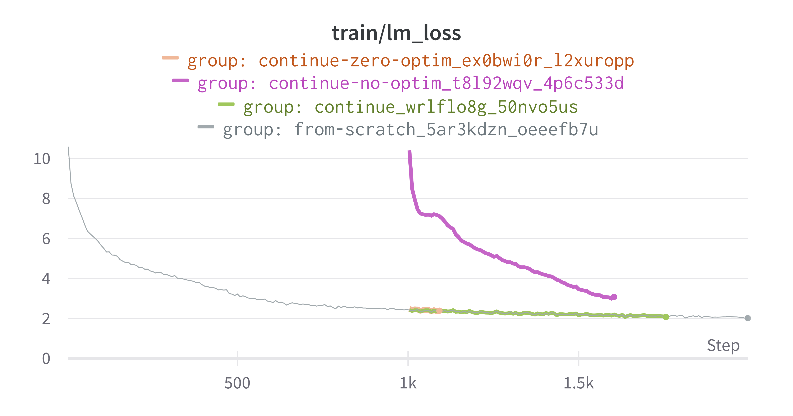
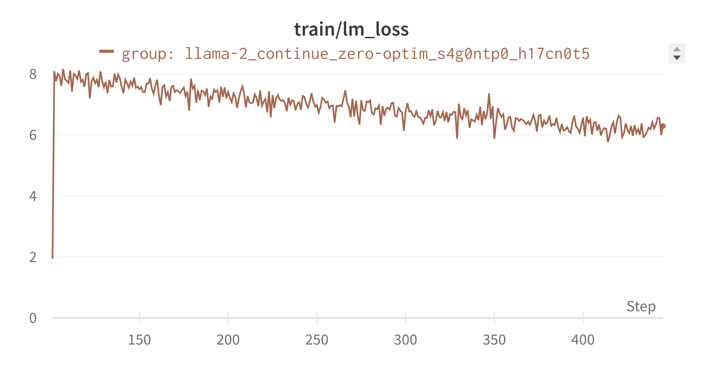

# Bfloat16 checkpointing bug report

## Environment:
Deepspeed commit: `71e51925f4b0be6014ac5586cfa3a5c93a63a08e` on branch math-lm
    - This is almost identical to DeeperSpeed main, except Deepspeed pull [#3790](https://github.com/microsoft/DeepSpeed/pull/3790/files) is merged and the optimizer is hardcoded to the ZeRO optimizer on line 1197 of `engine.py`. Note that this issue still occurs without the hardcoded optimizer class, in which case BF16Optimizer gets used. 

NeoX commit: `6e19615ccc346ec09a9d975a66c6d233d12133ed` on branch math-lm. This is almost exactly the same as the latest main `8b3f1c28555ccad92e3b0906c71528be712c95d6`, except in `megatron/checkpointing.py:load_checkpoint()` `neox_args.finetune` is separated out into separate args (<https://github.com/EleutherAI/gpt-neox/compare/main...math-lm#diff-122925dfa160fba3c00803abba3577ef0d5aa5ab48989032a63d41c91f2a8002R228-R252>).

Also, `tools/datasets/corpora.py` works slightly differently and the branch includes a lot of extra configs. 

You can find the config files for the runs referenced in this report in this directory. Note the config files contain paths to data that are specific to the BYU cluster, however we expect this issue would replicate given any training data. All runs are done on a single node with a `dp_world_size` of 8. 

## Issue
When finetuning Llama-2 models in bfloat16, after the first training step there is a loss jump, and after this jump the model does not train faster than it does from a random initialization. This issue does not occur in Llama-1 models, which are in fp16.

## Toy case:
Loading a bfloat16 checkpoint and training in bf16 causes a loss jump that training does not recover from. In fact, we have verified that after the loss jump, the loss does not decrease faster than it does from a random initialization. 

The following graph depicts four toy training runs, all using roughly 1B parameter Llama-architecture models and trained in bf16. The run names on the legend correspond to the names of config files in this directory. 

The grey curve is a training run initialized from scratch, and behaves as expected. The green curve is the grey run restarted from a checkpoint, and this again works as expected. The purple run loads a checkpoint with the same weights as the green run, except the optimizer state is deleted from the checkpoint. This is intended to simulate what happens when initializing from a pretrained Llama-2 checkpoint, and causes a loss jump the model does not recover from. 

The brown run is a hacky fix to the issue. In order to load checkpoint with no optimizer state, we create a "fake" optimizer state where all tensors in checkpoint corresponding to optimizer states are populated with `torch.zeros`. Again this is somewhat hacky fix, but it would be satisfactory for our purposes.

## Fix fails on Llama 2
Here is how we tried to apply the fix from the toy case to Llama-2: First, we train a model with Llama 2 architecture from scrach for some small number of steps and save a checkpoint (this run is `llama-2_init-state`. Then, we replace the weights in this checkpoint with the pre-trained weights and replace the tensors in the optimizer state with zero tensors. Unfortunately, this still causes a loss jump.

## Summary
- We are uncertain why loading bfloat16 checkpoints that have no optimizer results in a loss jump that the model does not recover from. 
- We are uncertain why the hacky fix that works for the toy case does not work for Llama-2.

