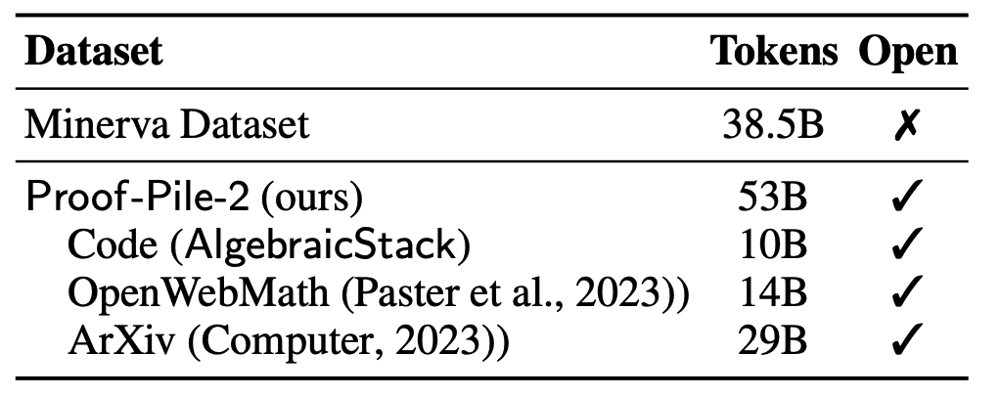
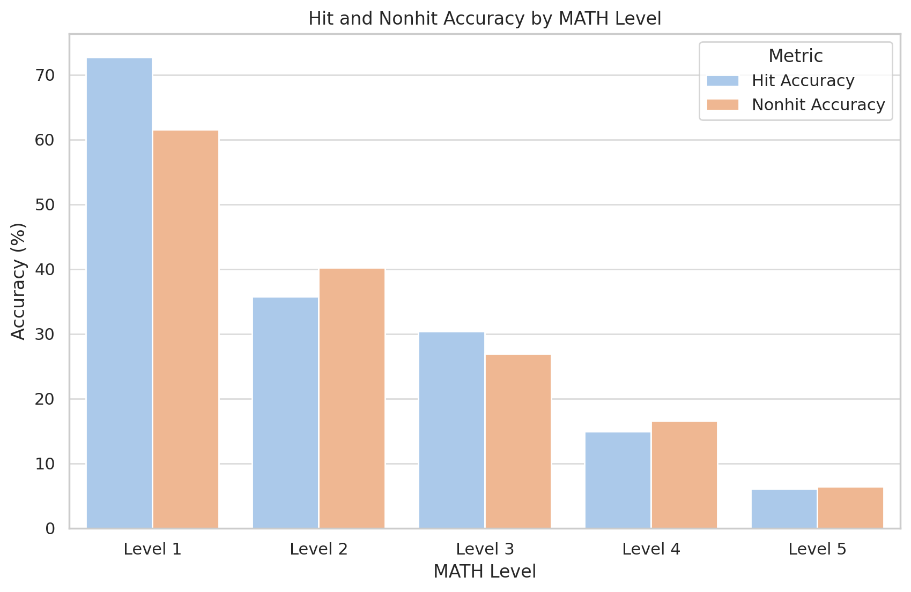

# Llemma: An Open Language Model For Mathematics

Today we release *Llemma*: 7 billion and 34 billion parameter language models for mathematics. The Llemma models were initialized with Code Llama weights, then trained on the Proof-Pile-2, a 55 billion token dataset of mathematical and scientific documents.

Our work parallels [Minerva](https://blog.research.google/2022/06/minerva-solving-quantitative-reasoning.html), a model suite specialized for quantitative reasoning developed by Google Research last year. While we don't achieve quite the same scale as Minerva, our Llemma models perform better on an equi-parameter basis. Moreover, we make our model and dataset open-access and our code open-source.

Language models with strong mathematical reasoning capabilities are upstream of a number of emerging research areas, such as reward modeling, algorithmic reasoning, and formal mathematics. We hope that by providing researchers with a much stronger base model for reasoning applications, Llemma will accelerate progress on these problems.

Because scale reliably produces better generalist models, specialized models often have a short shelf life. By open sourcing our dataset and code, we hope that Llemma's training recipe can be reused to improve the mathematical capabilities of future, stronger open models. 

### Dataset

The first step in developing Llemma was to assemble a large, high-quality quantitative reasoning dataset. Minerva used 38 billion unique tokens consisting of arXiv and math web pages. Our dataset, the Proof-Pile-2, contains arXiv, web data, and code for a total of 55B unique tokens. 

For the arXiv portion of the Proof-Pile-2, we use the RedPajama arXiv subset. Our web and code subsets, on the other hand, are new. We describe them below.

**Web**. The [OpenWebMath](https://huggingface.co/datasets/open-web-math/open-web-math) dataset, a recent 14.7 billion token dataset of mathematical web pages, is a sister project to Llemma. OpenWebMath was created by building a complete CommonCrawl processing pipeline, including HTML extraction, classifier-based filtering, and deduplication steps. 

**Code**. The modern mathematician increasingly relies on computational tools, from offloading difficult calculations to programs, to using software to verify proofs. Motivated by these applications, the Proof-Pile-2 includes 11 billion tokens of mathematical code, spanning numerical computing, computer algebra, and formal theorem proving. This training data allows for some interesting evaluations—more on this later. 

### Training
We trained Llemma 7B for 200B tokens and Llemma 34B for 50B tokens. This amounts to 23,000 A100 hours for Llemma 7B and 47,000 A100 hours for the 34B. Our training stack is built on a number of fantastic open source projects, including [GPT-NeoX](https://github.com/EleutherAI/gpt-neox/tree/llemma) and [FlashAttention-2](https://github.com/Dao-AILab/flash-attention). 

### Evaluation
Our first evaluation setting is chain-of-thought mathematical reasoning, measured by benchmarks such as MATH and GSM8k. This is a setting where open source base models have lagged: Llama-2 and Code Llama's MATH scores are in the mid-single digits. Llemma achieves a significant improvement on these tasks, and even surpasses Minerva when controlled for model parameters. 

The code subset of the Proof-Pile-2 endows Llemma with capabilities Minerva lacks without additional finetuning. In this blog post, we'll discuss *formal theorem proving*. Our paper contains additional results on a Python-aided problem solving task. 

Formal theorem proving consists of writing a *machine-checkable proof* in a language such as Lean or Isabelle. Evaluating the theorem proving abilities of language models by manually checking LaTeX proofs is completely unscalable. In contrast, formal proofs come with an automatic and infallible correctness judgement. 

Up until now, machine learning approaches to formal theorem proving have either relied on models finetuned for a specific language, or proprietary models such as GPT-4. To our knowledge, Llemma is the first demonstration of in-context theorem proving by an open base model. Our results on the standard miniF2F benchmark surpass GPT-4 based approaches and are comparable to finetuned models. 

| Method        | miniF2F test |
|---------------|--------------|
| [ReProver](https://leandojo.org/) (finetuned) | 26.50%       |
| [Copra](https://arxiv.org/abs/2310.04353) (GPT-4 based) | 23.36% |
| Code Llama 7b | 20.49%       |
| Code Llama 34b| 22.13%       |
| Llemma-7b     | 26.23%       |
| LLemma-34b    | 25.82%       |

### Memorization
Language model evaluations are partly a memorization test and partly a generalization test, but it is often unclear in what proportion. We seek to quantify the degree to which our evaluations are explained by memorization by looking for MATH reference solutions in our training set. Surprisingly, Llemma doesn't perform any better on MATH problems that are contained in its training set. In the table below, a "hit" denotes a 30-gram overlap betweeen an MATH reference and the training set. 

We [open-source the tools](https://github.com/wellecks/overlap) we used for our analysis, and encourage other researchers to investigate other ways to detect and quantify the effects of memorization. 

### Future directions 
Llemma is a pretrained base model; therefore, our evaluations are only a starting point for further research into the mathematical abilities of language models. To conclude, we note a few promising directions that Llemma might enable. 

**Reward modeling and reinforcement learning**. [Recent work by OpenAI](https://arxiv.org/abs/2305.20050) demonstrates the effectiveness of guiding mathematical problem solving with a reward model. How can we improve upon this approach?

**Formal theorem proving**. Our in-context learning evaluations are minimal working examples of formal theorem proving with Llemma. What is possible with some finetuning and better algorithms? Can Llemma models tackle the [IMO Grand Challenge](https://arxiv.org/abs/2305.20050)? 

**Algorithmic Reasoning**. With very careful prompting, language models can [learn to execute algorithms](https://arxiv.org/abs/2211.09066). What would it take to elicit algorithmic reasoning from Llemma more flexibly and reliably?
