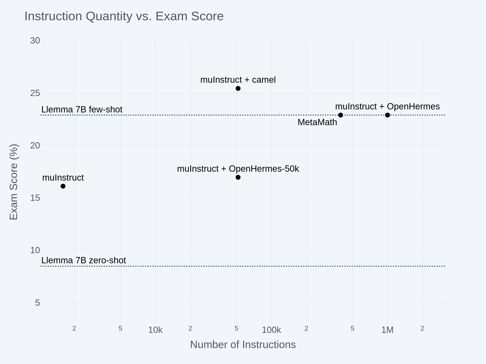

# Scaling Instruction Tuning For Math
The paper [LIMA: Less Is More for Alignment](https://arxiv.org/abs/2305.11206) introduced the **superficial alignment hypothesis** (SAH), whose statement is as follows 
> A model’s knowledge and capabilities are learnt almost entirely during pretraining, while alignment [i.e instruction finetuning[^1]] teaches it which subdistribution of formats should be used when interacting with users. If this hypothesis is correct, and alignment is largely about learning style, then a corollary of the Superficial Alignment Hypothesis is that one could sufficiently tune a pretrained language model with a rather small set of examples.

The goal of this post is to see whether this hypothesis holds when instruction tuning [`Llemma 7B`](https://huggingface.co/EleutherAI/llemma_7b), a language model for mathematics. If the SAH holds, we should expect to see a small, highly-curated dataset of mathematical instructions match the performance of larger datasets and outperform any larger but lower-quality dataset. 

In service of these experiments, we introduce [μInstruct](https://huggingface.co/datasets/EleutherAI/muInstruct), a dataset of 1600 high-quality mathematics instructions. Per the SAH, we shouldn't need to scale beyond this dataset in order to achieve strong instruction following. 

Clearly, a larger dataset that is identically distributed to μInstruct would yield at least no worse results. However, collecting high quality instruction data is expensive, requiring a significant investment of researcher or crowdworker time. Therefore, given fixed resources for data collection, strategies for scaling up the amount of instruction data must involve either:
1. Using lower quality data, which is cheaper to collect. 
2. Using data less targeted towards the model's use case. Although this more general instruction data does not come from the exact distribution we want to model, it still may enforce helpful biases such as directly addressing the user's request, staying on topic, and reasoning in a chain-of-thought style. 

To reflect these practical constraints, our experiments will testing the SAH by combining μInstruct with either lower quality mathematics data, or data from high-quality instruction datasets that is not necessarily related to mathematics. 

## Data
The μInstruct dataset was created from an initial pool of around 1900 highly-rated stack exchange answers, around 650 questions from the Khan Academy subset of the AMPS dataset, and around 550 questions from the MATH training set. Because the Khan Academy questions often had formatting issues, they were rewritten into valid markdown $\LaTeX{}$ by `gpt-3.5-turbo`. After this preprocessing, the initial 3,100 instructions were manually filtered down to around 1600 instructions. The μInstruct dataset contains a mix of straightforward school-level problems, some quite challenging problems, and a number of open-ended or soft questions. 

To stand in for a lower quality but larger math dataset than μInstruct, we use the [Camel-AI math dataset](https://huggingface.co/datasets/camel-ai/math), which contains 50,000 GPT-4 generated solutions to math problems. To stand in for a large, general-domain instruction dataset, we use [OpenHermes-2.5](https://huggingface.co/datasets/teknium/OpenHermes-2.5), another dataset of GPT-4 outputs. Note that as of March 2024, the OpenHermes-2.5 version of Mistral 7B has roughly the same ELO score as the official Mistral-7B-Instruct-v0.2 on [chatbot-arena](https://chat.lmsys.org/?arena). 

## Experiments

We conduct instruction tuning experiments at three data scales: 1600 instructions, 50k instructions and 1M instructions. For the 1600 instruction case, we train solely on μInstruct: this configuration reflects the superficial alignment philosophy. At 50k instructions, we train one model on a μInstruct + Camel mix and another on a μInstruct + OpenHermes mix. Finally, our only run at the 1M scale is a mixture of μInstruct and OpenHermes. 

We evaluate on the [Hungarian National Math Exam](https://huggingface.co/datasets/keirp/hungarian_national_hs_finals_exam), a "real-life" test of high-school math ability. We compare our instruction tuned models to zero-shot `Llemma 7B`, few-shot `Llemma 7B`, and `MetaMath-Llemma-7B`, a finetune of `Llemma 7B` trained on a data-augmented version of the MATH and GSM8k training sets. 

Our experimental results are below. 

Our results do not appear to be consistent with the SAH. Most notably, we are only able to recover the performance of few-shot prompting by training on datasets with at least 50k instructions. 

Furthermore, these results illustrate the potential dangers of finetuning. Unless finetuning is done very carefully with a sufficiently large dataset and a well-optimized data mixture, the finetuned model may perform much worse than the few-shot baseline. It is also worth noting that although `MetaMath-Llemma 7B` beats `Llemma 7B` by a large margin on MATH, the MetaMath model doesn't score better on Hungarian math. This result suggests the MetaMath model is highly specialized towards the MATH problem distribution and has weaker general problem-solving ability than its MATH score would suggest. 

The most important limitation of our findings is that `Llemma 7B` is a small model by 2024 standards, and larger models are both more sample efficient and have greater latent reasoning capabilities that may be harmed by poor quality data. Both of these factors would suggest small high-quality datasets may work better for larger models. 

## Open Source

The [μInstruct](https://huggingface.co/datasets/EleutherAI/muInstruct) dataset and [`llemma_7b_muinstruct_camel`](https://huggingface.co/EleutherAI/llemma_7b_muinstruct_camelmath) model are open-source. 

[^1] The LIMA authors use "alignment" to mean "ability to follow user instructions". I dislike this usage, as the word "alignment" typically denotes something that is in many circumstances contradictory to the LIMA author's usage. See, for example, [The alignment problem from a deep learning perspective](https://arxiv.org/abs/2209.00626). Nonetheless, I will defer to the LIMA author's terminology of "superficial alignment hypothesis", usually abbreviating it as SAH. 