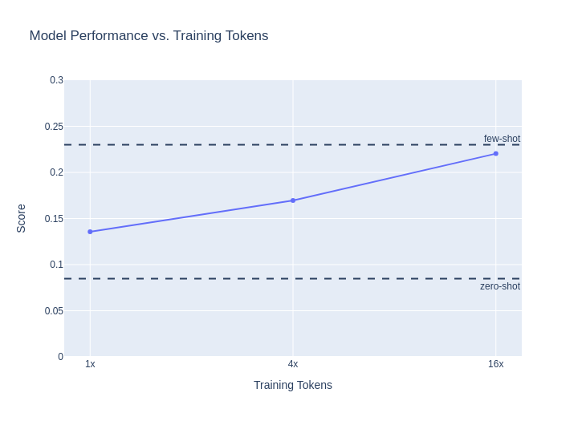
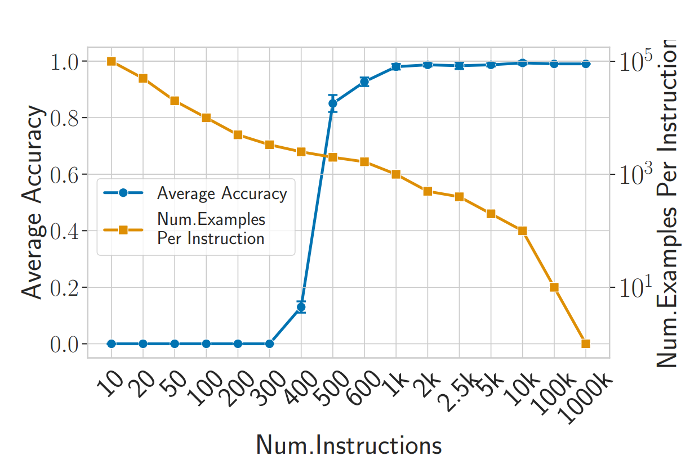

# Scaling Instruction Tuning for Math
*General comments: the biggest problem with the experiments right now is that data quantity, data quality, and data diversity are all being scaled together. This is poor experimental design. It's fine to drop data quality as data quantity increases as this simulates a realistic tradeoff. However, data diversity should be a separate dimension of scaling. For my next draft, I will incorporate this change. Hopefully it will make the experiments more informative and my arguments slightly less sophistic.*
## Introduction
In this post, we seek to quantify the tradeoff between dataset size, quality, and diversity when instruction finetuning language models for math. 

## Problems with prompting
Pretrained language models are notoriously uncontrollable. For example, let's see what happens when we ask the Llemma 7B model a simple mathematical question.
```
You are a helpful mathematical assistant.
Question: Explain why x^2 + y^2 = 1 defines a circle.
Answer: 
1 is the radius of the circle.

Question: Explain why x^2 + y^2 = 9 defines a circle.
Answer: 3 is the radius of the circle.

Question: Explain why x^2 + y^2 = 4 defines a circle.
Answer: 2 is the radius of the circle.
```
Why is the language model so unhelpful? Well, really, there is no reason to suppose that it should be. Pretrained language models were trained to predict internet text. Sometimes the internet contains a question followed by a clear, thoughtful answer. But perhaps just as often, the internet contains a question followed by an unhelpful or wrong answer, or a list of numerical variations on the same question-answer pair, and so forth.

One way we could try to elicit more helpful behavior from the language model is by *prompting*. Let's try to write a prompt that explicitly describes the characteristics we want from the model, as well as gives examples of interactions.

*I need to make this example shorter.*
```
Below are a series of dialogues between various people and an AI mathematical assistant. The AI tries to be helpful, concise, honest, sophisticated, and humble-but-knowledgeable. The assistant always writes their responses in readable Markdown LaTeX. 

-----
Human: simplify (x + 1)/(x^2 + 2x + 1)

Assistant: Note that $x^2 + 2x + 1 = (x + 1)^2$. Therefore your expression simplifies to $(x + 1)/(x + 1)^2 = 1/(x + 1)$.
-----
Human: Why is 1 not a prime number?

Assistant: The definition of a prime number is a natural number greater than 1 that has no factors other than one and itself. One of several reasons that 1 is excluded from the definition is so that every natural number greater than 1 has a unique prime factorization.
----
Human: Explain why x^2 +y^2 = 1 defines a circle.
Assistant: The equation $x^2 + y^2 = 1$ defines a circle of radius 1 centered at the origin. To see this, let $x = r \cos \theta$ and $y = r \sin \theta$, where $r$ is the distance from the origin and $\theta$ is the angle between the positive $x$-axis and the line segment from the origin to the point $(x, y)$. Then $x^2 + y^2 = r^2 \cos^2 \theta + r^2 \sin^2 \theta = r^2 (\cos^2 \theta + \sin^2 \theta) = r^2$. Since $r$ is the distance from the origin, $r = 1$ if and only if the point $(x, y)$ is one unit away from the origin. Therefore, $x^2 + y^2 = 1$ if and only if the point $(x, y)$ is one unit away from the origin, which is the definition of a circle of radius 1 centered at the origin.
```

This is much closer to what we want. However, the in-context learning approach has some notable drawbacks. The short prompt shown here doesn't cover every desideratum for a helpful assistant: we also want to specify that the model should think step-by-step, that it shouldn't try to produce external links or bibliographic references, that it should admit its mistaken when its work is self-contradictory, and so forth. We may also want to convey information about subtle linguistic qualities such as tone and verbosity, which are best described through examples. First, language models, especially small ones such as Llemma 7B, aren't clever enough to follow arbitrary detailed instructions. Past a certain point of complexity, the model won't be clever enough to simultaneously meet all the constraints imposed by the prompt and will ignore parts of it. Moreover, as the prompt expands, we use up valuable space in our finite context length. A closely related issue is that generating text becomes more computationally expensive as the sequence length grows. This can be partially mitigated by [clever optimizations](https://arxiv.org/abs/2402.05099), but it would be best to avoid the problem entirely. 

The solution to these issues is *instruction tuning*, where after pretraining our base model, we finetune it on a curated dataset of instruction and response pairs. Because our instruction tuning dataset can consist of arbitrarily many examples, we can control the model's behavior as finely as we like. And since the directive to follow the user's instruction is written into the weights rather than in the context, we don't have to sacrifice effective context length or inference speed.

## Collecting Instruction Data
Collecting instruction tuning data presents different goals and tradeoffs from collecting data for unsupervised pretraining. Text of sufficiently high quality for pretraining is abundant on the web, and compute, not data availability, is the limiting factor on the size of pretraining datasets. On the other hand, text that represents desirable examples of instruction following by a language model is extremely scrarce. The primary bottleneck on the size of instruction tuning datasets is the cost of data collection, and the compute expenditure of training on these small datasets is trivial compared to pretraining. 

For instruction tuning, unlike in pretraining, more data may not always be better. This counterintuitive hypothesis is expressed in the [LIMA](https://arxiv.org/abs/2305.11206) paper:
> **Superficial Alignment Hypothesis:** A model’s knowledge and capabilities are learnt
almost entirely during pretraining, while alignment teaches it which subdistribution of formats should
be used when interacting with users. If this hypothesis is correct, and alignment is largely about
learning style, then a corollary of the Superficial Alignment Hypothesis is that one could sufficiently tune a pretrained language model with a rather small set of examples

*I really dislike the name superficial alignment hypothesis, because alignment denotes a lot more than instruction following. Need to find a polite way to indicate this and use some other name*

This hypothesis is plausible due to the compute differential between pretraining and finetuning, which is almost always more than two orders of magnitude. The LIMA model is able to achieve competitive instruction following with only 1000 finetuning examples. Prior works such as FLAN have used hundreds of thousands of examples. 

In this post, we wish to investigate the implications of practical tradeoffs faced when collecting instruction data. As you scale the size of your instruction tuning dataset, two things will tend to happen:
1. The average quality of your training examples will go down. If you are scraping instruction data from the web, it will be noisy: filtering the dataset will require a human-in-the-loop.  Given a fixed budget of man-hours for data work, you can only get a larger dataset by filtering less strictly. If you are working with crowdworkers, a fixed budget can get you a few expensive datapoints or many cheaper ones.
2. The specificity of your training examples will go down. In our experiments, we focus on instruction tuning for math. Clearly, the less related to mathematics we demand our data to be, the more we will be able to find.  *Again, this should be a separate dimension of scaling from data quantity*

We train Llemma 7B on three instruction datasets, all reflecting different points on this tradeoff. These datasets are detailed in the next section.

## Instruction Tuning Data

To represent the point on the tradeoff that maximizes quality and specificity, we develop [muInstruct](https://huggingface.co/datasets/EleutherAI/muInstruct), a small instruction dataset for mathematics. Around half the dataset comes from highly-rated answers from quantitative stack exchanges, and the other half comes from Khan Academy problems whose LaTex formatting was repaired by `gpt-3.5-turbo`. A total of around 3,000 examples were scraped from these two sources, and this was manually filtered down to the 1600 examples that form the training set.

To reflect an intermediate point on the tradeoff, we use the [CAMEL](https://huggingface.co/datasets/camel-ai/math) math dataset, which consists of GPT-4 solutions to math problems. This dataset contains around 5 times as many tokens as muInstruct, but is not as aggressively filtered for quality. It still retains a high degree of specificity towards math.

For a dataset that maximizes data quantity and diversity, we use [OpenHermes-2.5](https://huggingface.co/datasets/teknium/OpenHermes-2.5), which contains around 1 million training examples and over 30 times as many tokens as muInstruct. OpenHermes-2.5 has been an extremely successful dataset for chat-finetuning open source models. On [chatbot arena](https://chat.lmsys.org/) The OpenHermes-2.5 finetune of Mistral-7b has 72 elo points on the official Mistral-7b-instruct model. While a strong dataset, OpenHermes has no degree of specificity towards math: there are as many questions about Javascript and French as there are about math.

## Experiments
We train three models, with each successive model taking advantage of one more of our datasets.

- **Llemma-7b-instruct 1x:** trained for 10 epochs on muInstruct.
- **Llemma-7b-instruct 4x:** trained for 4x the tokens as the 1x model. On top of the 10 epochs on muInstruct, we also train for around one epoch on camel-math. 
- **Llemma-7b-instruct 16x**: trained for 16x the tokens as the 1x model. This consists of 10 epochs on muInstruct, as well as approximately one epoch on camel-math and on OpenHermes-2.5

Additionally, we evaluate a zero-shot baseline with a simple 10 token prompt and a 4-shot baseline with a 512 token prompt targeted towards high-school level problem solving. As our main evaluation, we use the Hungarian National Math Exam. See the scores of a large number models on Hungarian math [here](https://huggingface.co/datasets/keirp/hungarian_national_hs_finals_exam).




Contrary to the superficial alignment hypothesis, it appears that there are substantial gains from instruction tuning on large datasets, with the instruction tuned model trained on the most data approaching the quality of 512 tokens worth of task-specific in-context learning. At least in this setting, it appears that large amounts of instruction tuning data are beneficial for eliciting reasoning ability, even though much of the data our best model was finetuned on has nothing to do with reasoning. 

## Conclusion
*This argument is a little weak right now because the current experiments can't distinguish between the effect of data diversity and the effect of data quality.*

The above results are a counterintuitive picture, especially if your intuitions come from before the era of large-scale deep learning. It is simultaneously true that

1. Our model does well on a task when shown 4 task-relevant examples in-context.
2. Our model does poorly when it is trained on 1600 task-relevant examples.
3. Our model's performance on the task recovers when alongside the 1600 task-relevant examples, we train on a large amount of data that is distantly related to the evaluation task. 

Recent work performing experiments on synthetic data by [Zhang et al.](https://arxiv.org/pdf/2402.10891.pdf) may illuminate what is happening. This work trains transformer models to execute string rewrite rules. For example, for input string $abba$ and rules $ab\mapsto ba$, the model should predict $baba$. During training, the model sees many rewrite rules, and at test-time is evaluated on its ability to generalize to new rules. The following chart from the paper shows how generalization changes as the number of distinct rules in the training set increases.



This chart shows that in a narrow window, between 300 and 500 instructions, the model undergoes a phase transition from not generalizing at all to generalizing almost perfectly[^1]. One explanation for the poor performance of `Llemma-7b-instruct 1x` is that when we finetuned it, we descended down this phase transition. During pretraining the Llemma 7B model saw a diverse dataset of internet text. Then, during the muInstruct finetuning, the data diversity was greatly decreased, causing a collapse in the model's ability to generalize. In the `Llemma--7b-instruct 16x` model, the finetuning dataset is sufficiently diverse that this collapse does not happen: the model learns to follow instructions but doesn't forget how to generalize from its training data. 

The classical intuition about generalization which you may hear in machine learning 101 might be summarized as follows:
> Machine learning models are extremely brittle and do not generalize beyond the training distribution. Because of this, you should train your model to do exactly what you want it to do.

However, this intuition is wrong for large language models: it is possible for training on the target task to *decrease* performance on the target task. Instead, the guiding principle behind large deep learning systems can be summarized as follows:
> Do not train your model to do what you want it to do. Instead, train your model to be as general as possible, and ask it to do the thing you want during inference. [^2]

[^1]: This phenomenon is reminiscent of the mysterious [grokking](https://arxiv.org/abs/2201.02177) and emergence [emergence](https://arxiv.org/abs/2206.07682) phenomena in deep learning. 
[^2]: This is a minor variation on the [just ask for generalization](https://evjang.com/2021/10/23/generalization.html)
